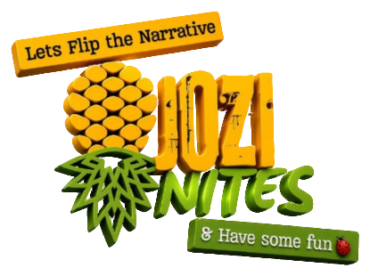

# Jozi Nites Website

<p align="center">
  
</p>

**Your Hub for all South African Adult Content** 🍑🍆💦

Official website for **Jozi Nites** — a Wellness Initiative bridging the gap in society around Taboo Topics, Stereotypes, Health & Safety, Education, and Stigma related to Adult Content Services & Providers.

**Live site:** [https://jozi-nites-hub.github.io/Website/](https://jozi-nites-hub.github.io/Website/)

---

## About Jozi Nites

Jozi Nites is a South African Non-Profit Company (NPC) that creates a safe space to discuss, experience, and learn about adult content, creators, education, local merchants, and community stories.

We bring together:
- **Creators** 📸
- **Education & Information**
- **Local Merchants** 🛍️🛒
- **Gig Guide** 🎉
- **Podcast** featuring creators, victims, survivors, mentors & the community 🎙️

Founded by **John Black Pipes (JB)**.

---

## Project Structure
Website/
├── index.html              # Main landing page (age-gated)
├── admin/                  # Admin area (future)
├── favicon.ico / .png      # Site icons
├── apple-touch-icon.png
├── jozi-nites-logo.png     # Primary logo
├── bg-johannesburg.jpg     # Background image
├── logo.png / pineapple.png
├── LICENSE                 # MIT License
├── CONTRIBUTING.md         # Contribution guidelines
└── README.md

---

## Features

- **18+ Age Gate** — Consent overlay required before entering the site
- Dark, modern Johannesburg-inspired design
- Fully responsive (mobile-first)
- Sticky navigation
- Sections for About, Programs, Glossary, Contact
- Placeholder links ready for future expansion (Library, Gig Guide, Podcast, Merchants, etc.)

---

## Tech Stack

- Pure **HTML + CSS + Vanilla JS** (no frameworks)
- Hosted on **GitHub Pages**
- Google Fonts: Bebas Neue + Poppins
- Custom design tokens (gold accent on near-black)

---

## Local Development

1. Clone the repo:
   ```bash
   git clone https://github.com/Jozi-Nites-Hub/Website.git
   cd Website

2. Open index.html in a browser, or serve it locally:

   python -m http.server 8000

4. Visit http://localhost:8000

## Age Gate Notes
The age gate (#consent-overlay) must remain a single instance in the HTML.
Clicking “I am 18+ Enter” hides the overlay and reveals the main site.
Clicking “Exit” redirects to Google.
Duplicate overlays will cause the gate to appear “stuck”.

## Deployment
This site is automatically served via GitHub Pages from the main branch.
Any push to main updates:
https://jozi-nites-hub.github.io/Website/

## Contributing
We welcome contributions!
Please read the full guidelines in CONTRIBUTING.md before opening a pull request.

## License
This project is licensed under the MIT License.
See the LICENSE file for details.

## Roadmap / Upcoming
[ ] Full Creator / Model Library
[ ] Service Provider Directory
[ ] Gig Guide
[ ] Podcast section
[ ] Merchant marketplace
[ ] Contact form backend
[ ] Admin panel

## Contact & Links
Founder: John Black Pipes (JB)
Organisation: Jozi Nites NPC — South African Non-Profit Company
Website: jozi-nites-hub.github.io/Website

© 2025–2026 Jozi Nites NPC — South African Non-Profit Company
All rights reserved.


---

**Note:**  
Make sure the file `jozi-nites-logo.png` (the one you just showed) is in the root of the repository. If the current logo in the repo is different, just replace it with this new version so the README displays the correct one.
